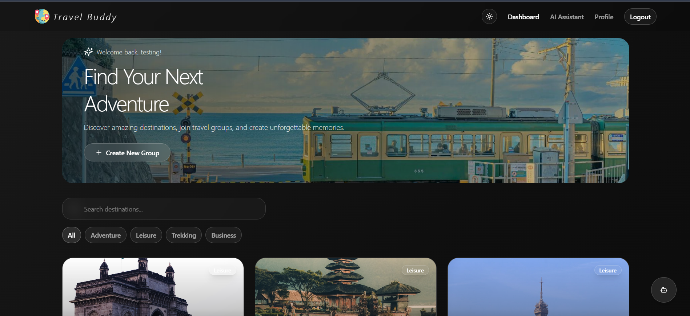
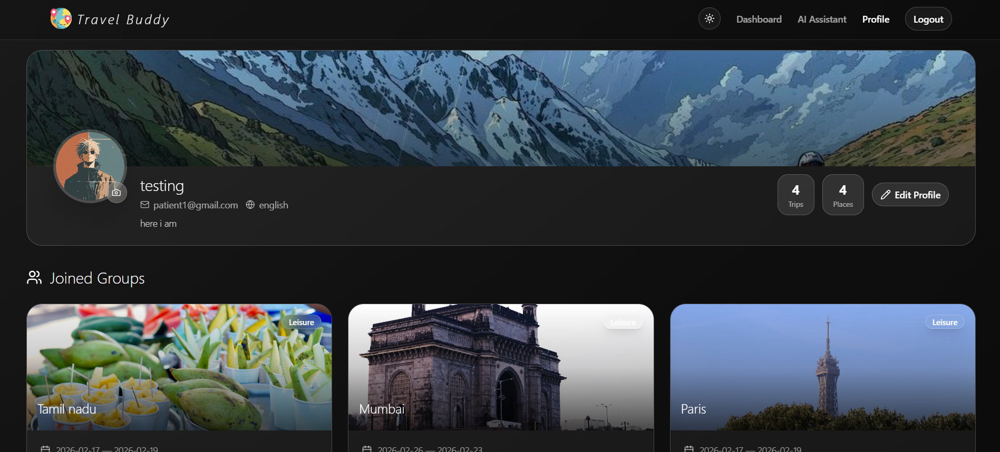
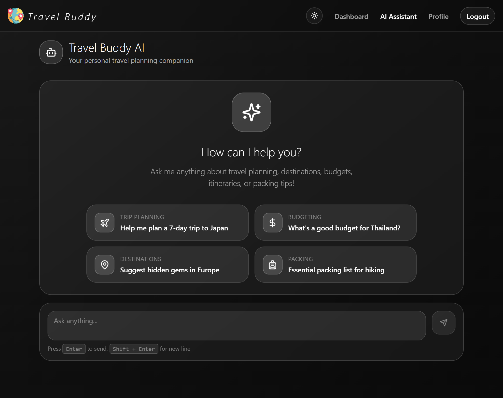

# Travel Buddy 🌍✈️

Travel Buddy is a modern, feature-rich group travel planning application designed to make organizing trips with friends seamless and enjoyable. From collaborative itinerary planning to real-time expense tracking and an AI-powered travel assistant, Travel Buddy has everything you need to explore the world together.

## 🚀 Features

*   **🌍 Group Trip Planning:** Create trips, invite friends, and manage travel details collaboratively.
*   **🤖 AI Travel Assistant:** Get instant travel tips, itinerary suggestions, and local insights from our integrated Gemini AI assistant.
*   **💬 Real-time Chat:** Stay connected with your group using built-in real-time messaging, including image sharing.
*   **💰 Expense Tracking:** Easily split bills, track shared expenses, and calculate automatically who owes whom.
*   **🗺️ Interactive Itineraries:** Visualize your trip with interactive maps, utilizing multiple location markers.
*   **🏨 Hotel Search:** Find the perfect stay with integrated hotel search functionality.
*   **🎨 Stunning UI:** Experience a beautiful, responsive interface built with modern design principles, dark mode support, and smooth animations.
*   **🔐 Secure Authentication:** Robust user management powered by Firebase.

## 📸 Screenshots

### Landing Page
Experience our immersive entry into the world of travel.


### Dashboard
Manage your active trips, upcoming adventures, and past memories all in one place.


### Group Details & Profile
Collaborate on expenses, chat with friends, and manage your travel profile.


### AI Assistant
Your personal travel guide, available 24/7 to answer questions and plan your day.


## 🛠️ Tech Stack

*   **Frontend:** [React](https://react.dev/), [TypeScript](https://www.typescriptlang.org/), [Vite](https://vitejs.dev/)
*   **Styling:** [Tailwind CSS](https://tailwindcss.com/), [Shadcn UI](https://ui.shadcn.com/), [Framer Motion](https://www.framer.com/motion/)
*   **Backend / Database:** [Firebase](https://firebase.google.com/) (Firestore, Auth, Storage)
*   **Maps:** [Leaflet](https://leafletjs.com/)
*   **Icons:** [Lucide React](https://lucide.dev/)

## ⚙️ Installation & Setup

Follow these steps to get the project running on your local machine.

1.  **Clone the repository**
    ```bash
    git clone https://github.com/yourusername/wander-together.git
    cd wander-together
    ```

2.  **Install dependencies**
    ```bash
    npm install
    ```

3.  **Run the development server**
    ```bash
    npm run dev
    ```

    The application should now be running at `http://localhost:8080`.

## 🤝 Contributing

Contributions are welcome! Whether it's reporting a bug, suggesting a feature, or writing code, we value your input.

1.  Fork the repository.
2.  Create a new branch (`git checkout -b feature/YourFeature`).
3.  Commit your changes (`git commit -m 'Add some feature'`).
4.  Push to the branch (`git push origin feature/YourFeature`).
5.  Open a Pull Request.

## 📄 License

This project is licensed under the MIT License - see the LICENSE file for details.


